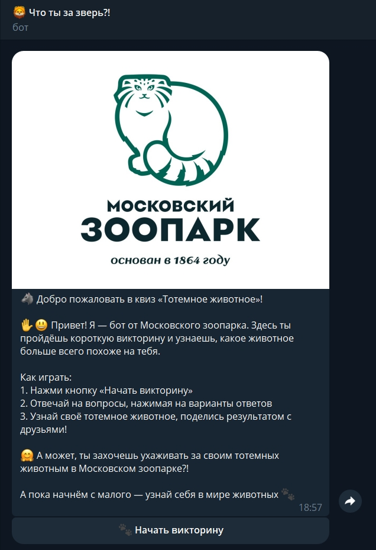
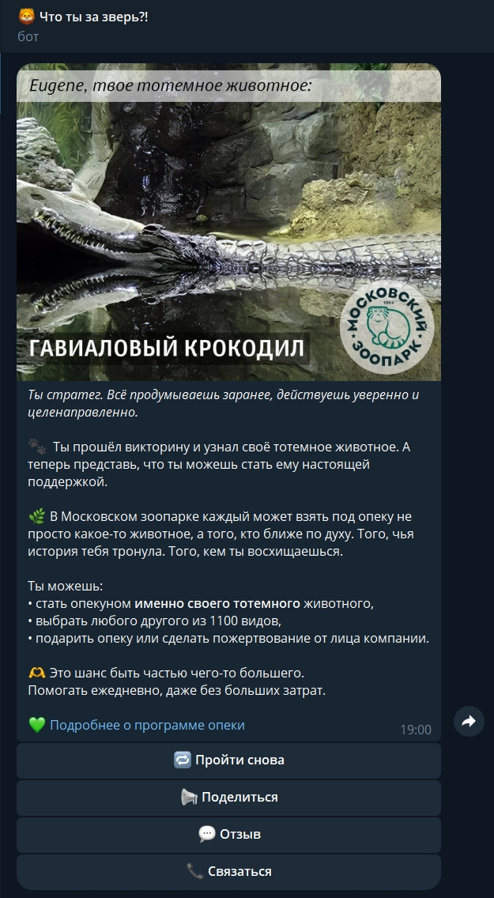

#### Ковалёв Евгений.
#### Учебный проект по курсу "Язык программирования Python".
#### МИФИ, магистратура ИИКС, 1 курс

-------------
# Итоговый проект: разработка Telegram-бота для Московского зоопарка

Задача проекта - Telegram-бот, разработанный для популяризации программы опеки Московского зоопарка.  
Бот представляет собой викторину "Какое у вас тотемное животное?" и помогает пользователю подобрать животное на основе его ответов.

---

## Задание

Цель проекта — создать интерактивного Telegram-бота, который:
- проводит викторину,
- анализирует результаты,
- предлагает пользователю животное по его характеру,
- рассказывает о программе опеки,
- поддерживает социальные сети,
- позволяет связаться с сотрудником зоопарка,
- собирает обратную связь.

---

## Реализованный функционал

- Приветственное сообщение с кнопкой запуска викторины
- Система вопросов с вариантами ответов (FSM)
- Подсчёт результатов на основе весов
- Генерация изображения с результатом викторины
- Кнопка "Поделиться" результатом
- Возможность повторного прохождения
- Механизм отправки отзыва
- Сохранение контактных запросов с информацией о пользователе и его тотемном животном
- Логирование действий
- Конфигурация через `.env`

---

## Стек технологий

- **Python 3.10+**
- **aiogram 3.x** — фреймворк для работы с Telegram Bot API
- **Pillow** — генерация изображений
- **python-dotenv** — загрузка переменных окружения
- **JSON** — хранение данных о животных и вопросах

---

## Установка и запуск

### 1. Клонируйте репозиторий

```bash
git clone https://github.com/eugenekweb/python-MZoo_bot.git
cd python-MZoo_bot
```

### 2. Установите зависимости

```bash
pip install -r requirements.txt
```

### 3. Создайте файл `.env` в корне проекта

Пример содержимого:

```
TELEGRAM_API_TOKEN=ваш_токен_от_BotFather
GUARDIANSHIP_LINK=https://moscowzoo.ru/about/guardianship
```

> Получить токен можно через [@BotFather](https://t.me/BotFather) в Telegram.

### 4. Запустите бота

```bash
python -m src.bot.main
```

---

## Как проверить работу бота в Telegram

1. Найдите вашего бота в Telegram по имени, которое вы указали при регистрации.
2. Отправьте команду `/start`.
3. Нажмите кнопку **«🐾 Начать викторину»**.
4. Пройдите все вопросы.
5. В конце получите результат с изображением и описанием вашего тотемного животного.
6. Попробуйте использовать кнопки:
   - **🔁 Пройти снова**
   - **📢 Поделиться**
   - **💬 Отзыв**
   - **📞 Связаться**

---

## Структура проекта

```
├── zoo_bot/
│   ├── .env
│   ├── README.md
│   ├── requirements.txt
│   ├── data/
│   │   ├── logs/
│   ├── media/
│   │   ├── fonts/
│   │   ├── generated/
│   │   ├── images/
│   │   ├── logo/
│   ├── src/
│   │   ├── bot/
│   │   │   ├── main.py
│   │   │   ├── router.py
│   │   │   ├── core/
│   │   │   ├── handlers/
│   │   │   ├── keyboards/
│   │   │   ├── services/
│   │   │   ├── states/
```

---

## Примеры, как выглядит бот в работе (скриншоты)




